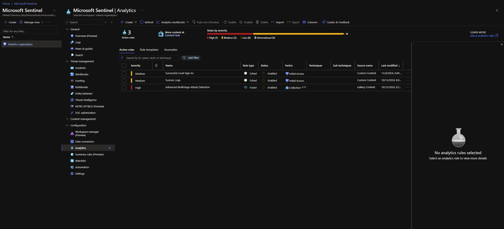

---
# By default, content added below the "---" mark will appear in the home page
# between the top bar and the list of recent posts.
# To change the home page layout, edit the _layouts/home.html file.
# See: https://jekyllrb.com/docs/themes/#overriding-theme-defaults
#
layout: home
---
<h1 style="text-align: center;">Hello and Welcome to my GitHub Page!</h1>

 I will be taking you through the projects I have completed and outlining the experience I've gained from them. 

<h2> Network Security </h2>

 (Zoom for a better view.) 
 

 I built my own SIEM through Microsoft Azure. I then added Microsoft Sentinel and set security rules to generate alerts for malicious activity that it may pick up. This sharpened my knowledge and familiarity with security tools and mitigation, preparing me to recognize and remediate threats to a network, system, or Web server. 

